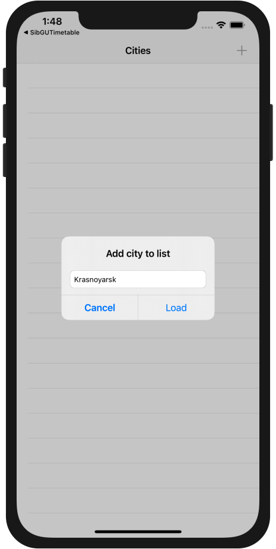
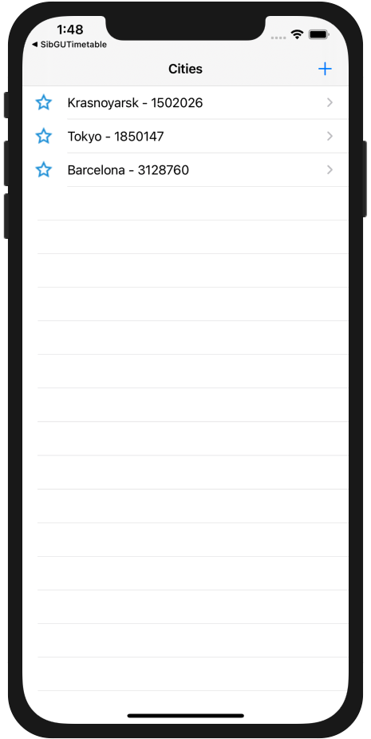
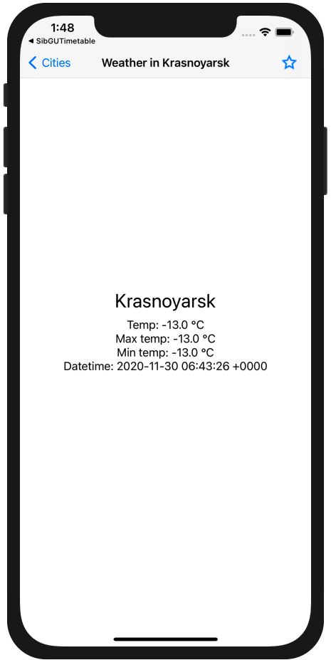
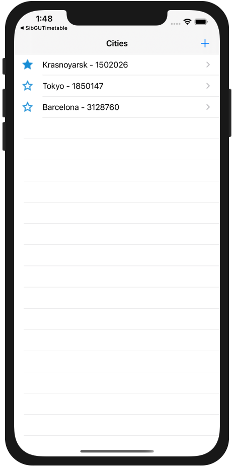
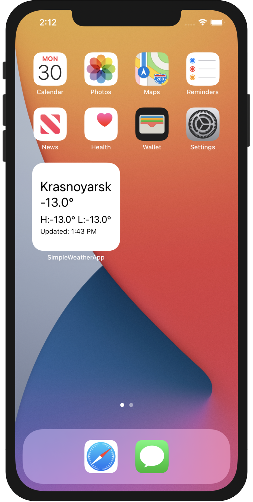

Simple Weather App
=====
Get a forecast for any location. App's using [OpenWeatherMap](https://openweathermap.org/api)

The app is written using tools:
- Swift 5
- Swift PM for modularization
- UIKit
- Alamofire
- Mocker
- Realm

## Features
- Add any city to list
- Update all city's weather at one time
- Widget on the home screen for the favorite city

## Architecture
Application is divided into layers according to Clean App Architecture.

### Application Layer
It's where the user can interact with the application. All views are based on MVP-pattern.

### Data Layer
Implementation of Domain's use cases. It's connected with Local and Server repositories.

### Local Repository and Server Repository
Implementation of Domain's Repository protocol.

### Domain
Define business-logic, entities and common protocols. It doesn't depend on UIKit or any persistence framework.

### Screens

